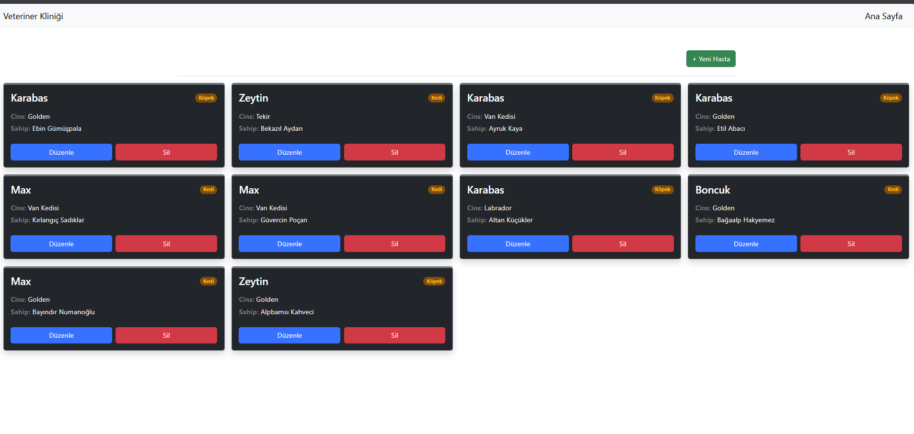
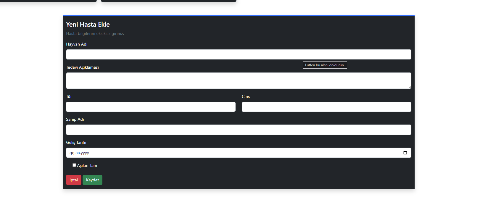
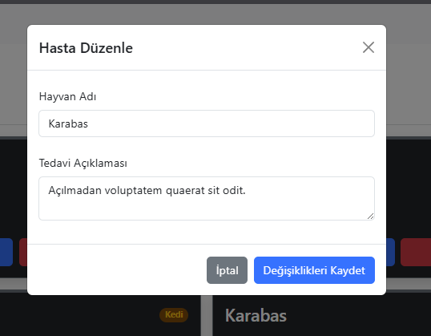
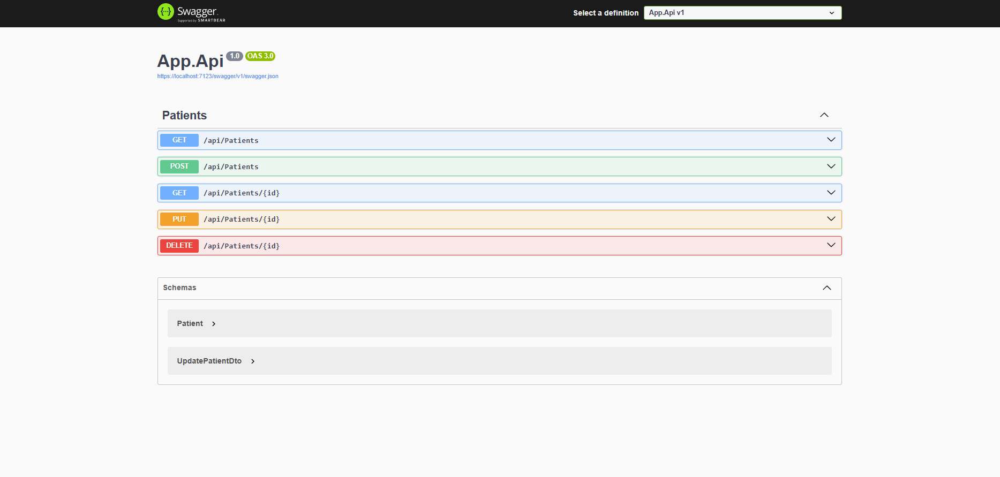

# PatiDost – Veterinary Clinic Management System

PatiDost is a simple full-stack veterinary clinic management project built with ASP.NET Core Web API and a Bootstrap-based frontend.

The system allows managing patient records with basic CRUD operations.

---

## 📌 Project Overview

This project consists of:

- ASP.NET Core Web API (Backend)
- Entity Framework Core
- SQL Server (LocalDB)
- Swagger (API testing)
- HTML, Bootstrap, JavaScript (Frontend)

The database is automatically created using `EnsureCreated()` on application startup.

---

## 🖥 User Interface

### 🏠 Patient Listing Page

Displays all registered patients in a responsive card layout.

- Patient name
- Species badge
- Breed
- Owner information
- Edit button
- Delete button

---

### ➕ Add New Patient

A dynamic form section allows adding new patients.

Fields:

- Animal Name
- Treatment Description
- Species
- Breed
- Owner Name
- Visit Date
- Vaccination Status

---

### ✏ Edit Patient

Patients can be updated using a Bootstrap modal.

Editable fields:

- Animal Name
- Treatment Description

---

## 🔎 API Documentation (Swagger)

Swagger UI provides interactive API testing.

Available endpoints:

- `GET /api/Patients`
- `GET /api/Patients/{id}`
- `POST /api/Patients`
- `PUT /api/Patients/{id}`
- `DELETE /api/Patients/{id}`

---

## 🗄 Database

- SQL Server LocalDB
- Automatically created via `EnsureCreated()`
- No migrations used in this version

Connection string:

